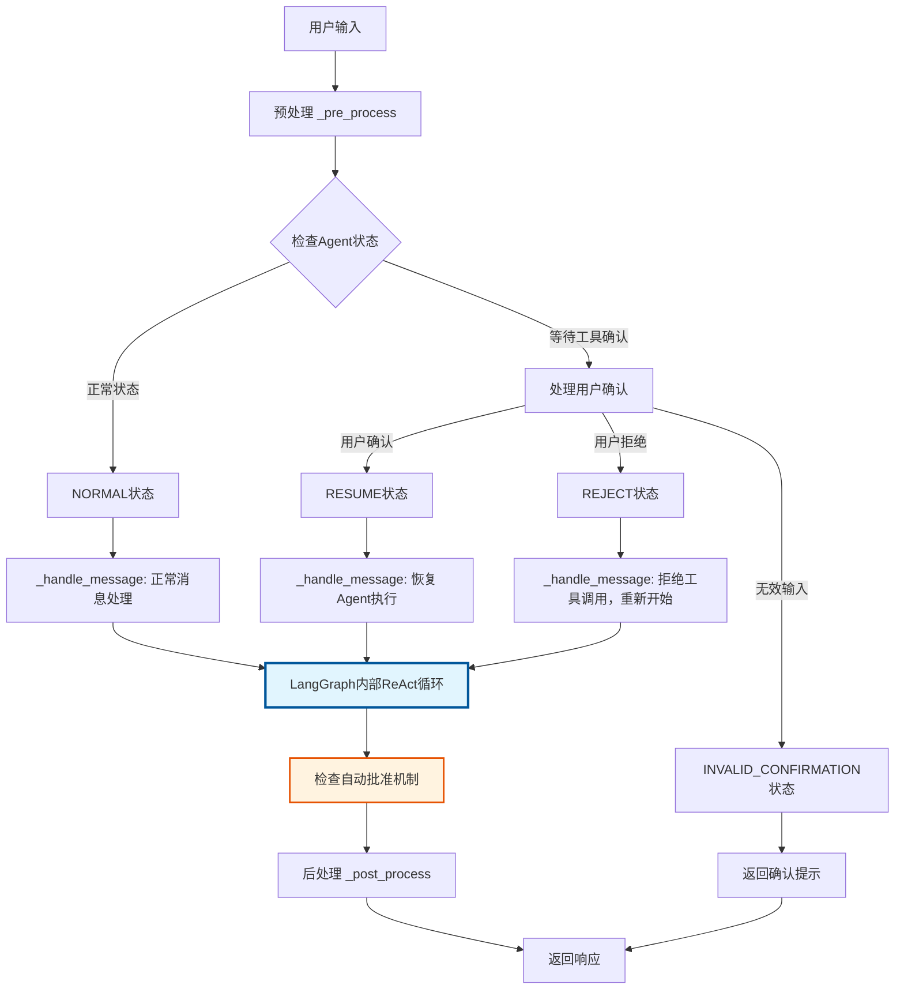
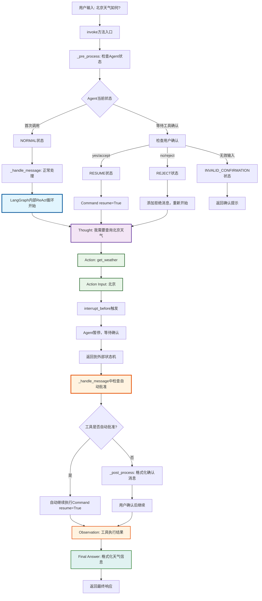

# React Agent 中文文档

## 概述

本项目实现了一个基于 LangGraph 的 React Agent，提供了工具调用确认机制、自动批准功能和状态管理。React Agent 是一个可以推理和行动的智能代理，它能够使用工具来解决问题。

## 架构设计

### 核心组件

1. **ReactAgent 类**: 主要的Agent包装器
2. **Internal Tools**: 模拟的工具集合（天气查询、家人信息查询）
3. **Prompt 模板**: 详细的提示模板，定义Agent的行为
4. **状态管理**: 基于枚举的状态机制

### 技术栈

- **LangGraph**: 用于构建状态机和Agent工作流
- **LangChain**: 提供工具装饰器和消息类型
- **Python 异步编程**: 支持并发处理
- **内存检查点**: 用于状态持久化

## 工作原理详解

### 1. LangGraph React Agent 机制

LangGraph 的 `create_react_agent` 创建了一个基于 ReAct（Reasoning and Acting）模式的Agent：

```python
# 创建Agent时的关键参数
self.agent_executor = create_react_agent(
    model=self.llm,                    # 语言模型
    tools=self.tools,                  # 工具列表
    checkpointer=MemorySaver(),        # 内存检查点，用于状态持久化
    prompt=prompt,                     # 提示模板
    interrupt_before=['tools']         # 在工具调用前暂停
)
```

#### ReAct 工作模式
ReAct 模式让Agent按照以下循环工作：
1. **Thought**: 思考当前问题
2. **Action**: 决定使用哪个工具
3. **Action Input**: 确定工具的输入参数
4. **Observation**: 观察工具的输出结果
5. **Final Answer**: 基于观察结果给出最终答案

### 2. 状态机机制

Agent 使用状态枚举来管理不同的处理流程：

```python
class State(Enum):
    INVALID_CONFIRMATION = "INVALID_CONFIRMATION"  # 无效确认状态
    RESUME = "RESUME"  # 恢复执行状态
    NORMAL = "NORMAL"  # 正常处理状态
    REJECT = "REJECT"  # 拒绝执行状态
```

#### 状态转换流程



**说明：**
- 蓝色框表示LangGraph内部处理
- 橙色框表示外部状态机的自动批准检查
- 外部状态机负责：拦截、确认处理、恢复执行
- LangGraph内部负责：Thought、Action、Action Input、Observation、Final Answer

### 3. 工具调用确认机制

#### interrupt_before 机制
设置 `interrupt_before=['tools']` 使Agent在调用工具前暂停，等待用户确认：

```python
# 当Agent准备调用工具时，会暂停并等待确认
if (len(state.next) > 0 and state.next[0] == "tools"):
    # 处理用户确认逻辑
    is_confirmed = self._handle_confirm(input["messages"])
```

### 4. React Agent 详细工作原理

#### ReAct 循环与状态机的结合

下面的详细流程图展示了外部状态机如何与 LangGraph 内部的 ReAct 循环协作：



**颜色说明：**
- 蓝色：LangGraph内部ReAct循环
- 紫色：LangGraph内部Thought阶段
- 绿色：LangGraph内部Action阶段
- 橙色：外部状态机处理（自动批准、观察结果）
- 深绿色：最终答案生成

#### 详细步骤说明

**第一阶段：请求处理与状态判断**

1. **用户输入处理**
   ```python
   # 用户发送: "北京天气如何？"
   input = {"messages": "北京天气如何？"}
   ```

2. **状态预处理**
   ```python
   def _pre_process(self, input, config) -> State:
       state = self.agent_executor.get_state(config=config)
       
       # 检查是否在等待工具确认
       if (len(state.next) > 0 and state.next[0] == "tools"):
           # 处理用户确认逻辑
           return self._handle_confirm_state(input)
       
       return State.NORMAL  # 首次调用返回正常状态
   ```

**第二阶段：LangGraph内部ReAct循环**

3. **Thought阶段（思考）**
   ```python
   # LangGraph内部，LLM根据提示模板生成思考
   # 输出: "Thought: 用户询问北京的天气，我需要使用get_weather工具来获取天气信息"
   ```

4. **Action阶段（行动决策）**
   ```python
   # LLM决定使用哪个工具
   # 输出: "Action: get_weather"
   ```

5. **Action Input阶段（参数确定）**
   ```python
   # LLM确定工具参数
   # 输出: "Action Input: 北京"
   ```

**第三阶段：工具调用拦截与自动批准检查**

6. **interrupt_before触发**
   ```python
   # 因为设置了interrupt_before=['tools']
   # LangGraph在实际调用工具前暂停
   # 此时Agent状态: state.next = ["tools"]
   ```

7. **外部状态机接管控制**
   ```python
   # 控制权回到外部状态机的_handle_message方法
   # 在这里检查是否需要自动批准
   async def _handle_message(self, message, config):
       response = await self.agent_executor.ainvoke(message, config)
       
       # 检查是否需要自动批准工具调用
       state = self.agent_executor.get_state(config=config)
       if (len(state.next) > 0 and state.next[0] == "tools"):
           tool_call = state.values["messages"][-1].tool_calls[0]
           # 如果工具在自动批准列表中，自动继续执行
           if tool_call["name"] in self.auto_approve_tools:
               response = await self._handle_message(Command(resume=True), config)
       
       return response
   ```

**第四阶段：用户确认处理**

8. **用户确认交互**
   ```python
   # 如果工具不在自动批准列表中，返回确认消息
   confirmation_msg = """
   Agent想要调用工具：
   {
       "name": "get_weather",
       "args": {"location": "北京"}
   }
   是否继续？
   """
   ```

9. **确认响应处理**
   ```python
   # 用户回复: "yes"
   # 下次调用时进入_pre_process
   def _handle_confirm(self, input: str) -> bool:
       lower_input = input.lower()
       if lower_input.startswith('yes') or lower_input.startswith('accept'):
           return True
       elif lower_input.startswith('no') or lower_input.startswith('reject'):
           return False
       return None
   ```

**第五阶段：工具执行与结果观察**

10. **恢复执行**
    ```python
    # 用户确认后，发送Command(resume=True)
    response = await self.agent_executor.ainvoke(Command(resume=True), config)
    ```

11. **Observation阶段（观察结果）**
    ```python
    # 工具执行完成，LangGraph将结果反馈给LLM
    # 输出: "Observation: {'location': '北京', 'weather': '晴天', 'temperature': 25, ...}"
    ```

12. **Final Answer阶段（最终答案）**
    ```python
    # LLM基于观察结果生成最终答案
    # 输出: "Final Answer: 根据最新信息，北京的天气情况如下：..."
    ```

#### 核心机制解析

**1. 外部状态机与 LangGraph 内部 ReAct 循环的分工**

```python
# 外部状态机负责：拦截、确认处理、恢复执行
class ReactAgent:
    def __init__(self):
        # LangGraph处理内部ReAct循环：Thought → Action → Action Input → Observation → Final Answer
        self.agent_executor = create_react_agent(
            model=self.llm,
            tools=self.tools,
            interrupt_before=['tools']  # 关键：在工具调用前暂停，让外部状态机接管
        )
    
    async def invoke(self, input, config):
        # 外部状态机决定如何处理
        state = self._pre_process(input, config)  # 拦截和状态判断
        
        if state == State.NORMAL:
            # 让LangGraph正常执行ReAct循环
            return await self._handle_message(input, config)
        elif state == State.RESUME:
            # 恢复被暂停的ReAct循环
            return await self._handle_message(Command(resume=True), config)
        # ... 其他状态处理
    
    async def _handle_message(self, message, config):
        # 调用LangGraph执行内部ReAct循环
        response = await self.agent_executor.ainvoke(message, config)
        
        # 外部状态机检查自动批准
        state = self.agent_executor.get_state(config=config)
        if (len(state.next) > 0 and state.next[0] == "tools"):
            tool_call = state.values["messages"][-1].tool_calls[0]
            if tool_call["name"] in self.auto_approve_tools:
                # 自动批准：直接恢复LangGraph执行
                response = await self._handle_message(Command(resume=True), config)
        
        return response
```

**2. interrupt_before 的关键作用**

```python
# 设置interrupt_before=['tools']的效果：
# 1. LangGraph内部完成Thought, Action, Action Input阶段
# 2. 在实际调用工具前暂停，控制权交给外部状态机
# 3. 外部状态机可以检查、确认、批准或拒绝工具调用
# 4. 外部状态机决定是否恢复LangGraph的执行
```

**3. 自动批准机制**

```python
# _handle_message中处理自动批准
async def _handle_message(self, message, config):
    # 调用Agent执行器
    response = await self.agent_executor.ainvoke(message, config)
    
    # 检查是否需要自动批准工具调用
    state = self.agent_executor.get_state(config=config)
    if (len(state.next) > 0 and state.next[0] == "tools"):
        tool_call = state.values["messages"][-1].tool_calls[0]
        # 如果工具在自动批准列表中，自动继续执行
        if tool_call["name"] in self.auto_approve_tools:
            response = await self._handle_message(Command(resume=True), config)

    return response
```

#### 完整交互示例

```python
# 完整的交互流程
async def example_interaction():
    agent = ReactAgent("weather_bot", llm, prompt)
    config = RunnableConfig(configurable={"thread_id": "user123"})
    
    # 第一次调用
    response1 = await agent.invoke(
        {"messages": "北京天气如何？"}, 
        config
    )
    print(response1)
    # 输出: "Agent想要调用get_weather工具，是否继续？"
    
    # 第二次调用（用户确认）
    response2 = await agent.invoke(
        {"messages": "yes"}, 
        config
    )
    print(response2)
    # 输出: "根据最新信息，北京的天气情况如下：..."
```

这个设计的优势在于：
1. **可控性**：用户可以决定是否执行工具调用
2. **透明性**：用户能看到Agent想要执行的具体操作
3. **灵活性**：支持自动批准和手动确认两种模式
4. **状态一致性**：通过checkpointer确保状态在多次调用间保持一致

#### 关键理解点

1. **ReAct循环是LangGraph内置的**：我们不需要手动实现Thought-Action-Observation循环，LangGraph会根据提示模板自动处理。

2. **interrupt_before是关键机制**：它让我们能够在工具调用前拦截并插入自己的逻辑（确认机制）。

3. **状态机包装了ReAct循环**：我们的状态机不是替代ReAct循环，而是在其基础上添加了额外的控制层。

4. **Command对象控制执行流**：通过Command(resume=True)或Command(goto="agent")来控制LangGraph的执行流程。

#### 自动批准机制
某些工具可以设置为自动批准，无需用户确认：

```python
# 在_handle_message中检查工具是否在自动批准列表中
async def _handle_message(self, message, config):
    response = await self.agent_executor.ainvoke(message, config)
    
    # 检查是否需要自动批准工具调用
    state = self.agent_executor.get_state(config=config)
    if (len(state.next) > 0 and state.next[0] == "tools"):
        tool_call = state.values["messages"][-1].tool_calls[0]
        # 如果工具在自动批准列表中，自动继续执行
        if tool_call["name"] in self.auto_approve_tools:
            response = await self._handle_message(Command(resume=True), config)
    
    return response
```

### 5. 状态持久化

使用 `MemorySaver` 实现状态持久化：

```python
# 状态保存和恢复
checkpointer=MemorySaver()

# 获取当前状态
state = self.agent_executor.get_state(config=config)

# 更新状态
self.agent_executor.update_state(config, {"messages": messages})
```

## 核心方法详解

### invoke() 方法
主要入口点，负责整个处理流程：

```python
async def invoke(self, input: Dict[str, Any], config: Optional[RunnableConfig] = None):
    # 1. 初始化检查和配置设置
    # 2. 预处理输入，确定当前状态
    # 3. 根据状态选择不同的处理流程
    # 4. 后处理响应
    # 5. 返回结果
```

### _pre_process() 方法
分析当前状态，确定处理流程：

```python
def _pre_process(self, input, config) -> State:
    state = self.agent_executor.get_state(config=config)
    
    # 检查是否正在等待工具调用确认
    if (len(state.next) > 0 and state.next[0] == "tools"):
        # 处理用户确认
        is_confirmed = self._handle_confirm(input["messages"])
        # 根据确认结果返回相应状态
```

### _post_process() 方法
处理Agent响应，检查是否需要用户确认：

```python
def _post_process(self, response, config):
    state = self.agent_executor.get_state(config=config)
    
    # 检查是否准备调用工具
    if (len(state.next) > 0 and state.next[0] == "tools"):
        tool_call = state.values["messages"][-1].tool_calls[0]
        
        if tool_call["name"] in self.auto_approve_tools:
            # 自动批准：直接恢复执行
            return await self._handle_message(Command(resume=True), config)
        else:
            # 需要用户确认，格式化消息
            return self._format_confirmation_message(tool_call)
    return response
```

### _handle_message() 方法
实际调用LangGraph Agent执行器：

```python
async def _handle_message(self, message, config):
    # 调用Agent执行器
    response = await self.agent_executor.ainvoke(message, config)
    
    # 检查自动批准逻辑
    if tool_call["name"] in self.auto_approve_tools:
        # 自动继续执行
        response = await self._handle_message(Command(resume=True), config)
    
    return response
```

## 工具系统

### 工具定义

使用 LangChain 的 `@tool` 装饰器定义工具：

```python
@tool
def get_weather(location: str) -> Dict[str, Any]:
    """查询指定地点的天气信息"""
    return _get_weather(location)

# 设置自动批准属性
get_weather.auto_approve = True
```

### 工具管理

```python
# 工具列表
TOOLS_LIST = [
    get_weather,
    get_family_names,
    get_family_member_by_relationship
]

# 自动批准配置
AUTO_APPROVE_TOOLS = {
    "get_weather": True,
    "get_family_names": True,
    "get_family_member_by_relationship": True
}
```

## 提示模板系统

### 详细提示模板

提示模板定义了Agent的：
- 角色和特质
- 工作流程
- 详细处理阶段
- 工具使用规范
- 回答模板
- 对话示例

### 关键提示元素

1. **角色定义**: 明确Agent的身份和能力
2. **工作流程**: 定义处理步骤
3. **工具说明**: 详细描述每个工具的用法
4. **格式规范**: 统一输出格式
5. **示例对话**: 提供具体的使用案例

## 使用指南

### 基本使用

```python
import asyncio
from llm_client import create_llm
from prompt import REACT_AGENT_PROMPT

async def main():
    # 创建LLM实例
    llm = create_llm()
    
    # 创建Agent
    agent = ReactAgent("chatbot", llm=llm, prompt=REACT_AGENT_PROMPT)
    
    # 调用Agent
    response = await agent.invoke({"messages": "北京的天气怎么样？"})
    print(response)

asyncio.run(main())
```

### 运行演示

我们提供了一个详细的演示脚本来展示React Agent的工作原理：

```bash
# 运行工作原理演示
python3 demo_react_flow.py
```

这个演示脚本会展示：
1. 完整的ReAct循环过程
2. 状态机的工作机制
3. 自动批准功能
4. 状态持久化机制

### 配置选项

```python
# 自定义配置
config = RunnableConfig(
    configurable={
        "thread_id": "user_session_123",  # 用户会话ID
        "user_id": "user_456"             # 用户ID
    }
)

response = await agent.invoke({"messages": "查询消息"}, config)
```

### 工具确认交互

```python
# 第一次调用 - Agent请求工具确认
response1 = await agent.invoke({"messages": "北京天气如何？"}, config)
print(response1)  # 输出: "要调用get_weather工具，是否继续？"

# 第二次调用 - 用户确认
response2 = await agent.invoke({"messages": "yes"}, config)
print(response2)  # 输出: 实际的天气信息
```

## 二次开发指南

### 1. 添加新工具

#### 步骤1: 定义工具函数

```python
# 在 internal_tools.py 中添加
def _get_stock_price(symbol: str) -> Dict[str, Any]:
    """获取股票价格 (Mock)"""
    return {
        "symbol": symbol,
        "price": 150.25,
        "change": "+2.5%"
    }

@tool
def get_stock_price(symbol: str) -> Dict[str, Any]:
    """获取股票价格"""
    return _get_stock_price(symbol)

# 设置自动批准
get_stock_price.auto_approve = True
```

#### 步骤2: 更新工具列表

```python
# 更新TOOLS_LIST
TOOLS_LIST = [
    get_weather,
    get_family_names,
    get_family_member_by_relationship,
    get_stock_price  # 新添加的工具
]

# 更新自动批准配置
AUTO_APPROVE_TOOLS = {
    "get_weather": True,
    "get_family_names": True,
    "get_family_member_by_relationship": True,
    "get_stock_price": True  # 新工具
}
```

#### 步骤3: 更新提示模板

```python
# 在prompt.py中添加工具说明
"""
## 4. get_stock_price(symbol: str)
**功能**: 获取股票价格信息
**参数**: 
- symbol: 股票代码（字符串）
**返回**: 包含股票价格、涨跌幅的字典
**使用场景**: 用户询问股票价格
"""
```

### 2. 自定义状态处理

#### 添加新状态

```python
class State(Enum):
    INVALID_CONFIRMATION = "INVALID_CONFIRMATION"
    RESUME = "RESUME"
    NORMAL = "NORMAL"
    REJECT = "REJECT"
    CUSTOM_STATE = "CUSTOM_STATE"  # 新状态
```

#### 实现状态处理逻辑

```python
def _pre_process(self, input, config) -> State:
    # 现有逻辑...
    
    # 自定义状态检查
    if self._check_custom_condition(input):
        return State.CUSTOM_STATE
    
    return State.NORMAL

# 在invoke方法中添加处理
elif previous_state == State.CUSTOM_STATE:
    response = await self._handle_custom_state(input, config)
```

### 3. 扩展确认机制

#### 自定义确认逻辑

```python
def _handle_confirm(self, input: str) -> bool:
    if input is not None:
        lower_input = input.lower()
        
        # 原有逻辑...
        
        # 自定义确认关键词
        if any(keyword in lower_input for keyword in ['proceed', 'continue', 'go ahead']):
            return True
        elif any(keyword in lower_input for keyword in ['stop', 'cancel', 'abort']):
            return False
    
    return None
```

#### 条件性自动批准

```python
def should_auto_approve(self, tool_name: str, tool_args: Dict) -> bool:
    """根据工具和参数决定是否自动批准"""
    
    # 基本的自动批准检查
    if tool_name in self.auto_approve_tools:
        return True
    
    # 自定义条件检查
    if tool_name == "get_weather" and len(tool_args.get("location", "")) < 10:
        return True
    
    return False
```

### 4. 添加中间件

#### 请求中间件

```python
class ReactAgent:
    def __init__(self, name: str, llm=None, prompt=None, middlewares=None):
        # 现有初始化...
        self.middlewares = middlewares or []
    
    async def invoke(self, input, config=None):
        # 执行前置中间件
        for middleware in self.middlewares:
            input = await middleware.before_invoke(input, config)
        
        # 原有逻辑...
        
        # 执行后置中间件
        for middleware in reversed(self.middlewares):
            processed_response = await middleware.after_invoke(processed_response, config)
        
        return processed_response
```

#### 中间件示例

```python
class LoggingMiddleware:
    async def before_invoke(self, input, config):
        print(f"接收到输入: {input}")
        return input
    
    async def after_invoke(self, response, config):
        print(f"返回响应: {response}")
        return response

class SecurityMiddleware:
    async def before_invoke(self, input, config):
        # 安全检查
        if self._contains_sensitive_data(input):
            raise ValueError("输入包含敏感信息")
        return input
    
    async def after_invoke(self, response, config):
        # 响应过滤
        return self._filter_sensitive_response(response)
```

### 5. 错误处理和重试

#### 添加错误处理

```python
async def _handle_message(self, message, config):
    max_retries = 3
    retry_count = 0
    
    while retry_count < max_retries:
        try:
            response = await self.agent_executor.ainvoke(message, config)
            return response
        except Exception as e:
            retry_count += 1
            if retry_count >= max_retries:
                return {"error": f"执行失败: {str(e)}"}
            
            # 等待后重试
            await asyncio.sleep(2 ** retry_count)
```

#### 工具调用错误处理

```python
@tool
def robust_get_weather(location: str) -> Dict[str, Any]:
    """带错误处理的天气查询"""
    try:
        return _get_weather(location)
    except Exception as e:
        return {
            "error": f"天气查询失败: {str(e)}",
            "location": location,
            "status": "error"
        }
```

### 6. 性能优化

#### 异步优化

```python
import asyncio
from concurrent.futures import ThreadPoolExecutor

class OptimizedReactAgent(ReactAgent):
    def __init__(self, *args, **kwargs):
        super().__init__(*args, **kwargs)
        self.executor = ThreadPoolExecutor(max_workers=4)
    
    async def _parallel_tool_calls(self, tool_calls):
        """并行执行多个工具调用"""
        tasks = []
        for tool_call in tool_calls:
            task = asyncio.create_task(self._execute_tool(tool_call))
            tasks.append(task)
        
        results = await asyncio.gather(*tasks, return_exceptions=True)
        return results
```

#### 缓存机制

```python
from functools import lru_cache
import hashlib

class CachedReactAgent(ReactAgent):
    def __init__(self, *args, **kwargs):
        super().__init__(*args, **kwargs)
        self.cache = {}
    
    def _get_cache_key(self, input_data):
        """生成缓存键"""
        input_str = str(input_data)
        return hashlib.md5(input_str.encode()).hexdigest()
    
    async def invoke(self, input, config=None):
        cache_key = self._get_cache_key(input)
        
        if cache_key in self.cache:
            return self.cache[cache_key]
        
        response = await super().invoke(input, config)
        self.cache[cache_key] = response
        
        return response
```

## 部署和集成

### 1. Web API 集成

```python
from fastapi import FastAPI, HTTPException
from pydantic import BaseModel

app = FastAPI()

class ChatRequest(BaseModel):
    message: str
    session_id: str

class ChatResponse(BaseModel):
    response: str
    session_id: str

@app.post("/chat", response_model=ChatResponse)
async def chat(request: ChatRequest):
    try:
        config = RunnableConfig(
            configurable={"thread_id": request.session_id}
        )
        
        response = await agent.invoke(
            {"messages": request.message}, 
            config
        )
        
        return ChatResponse(
            response=response,
            session_id=request.session_id
        )
    except Exception as e:
        raise HTTPException(status_code=500, detail=str(e))
```

### 2. 流式响应

```python
async def stream_response(self, input, config=None):
    """流式返回响应"""
    async for chunk in self.agent_executor.astream(input, config):
        yield chunk
```

### 3. 多租户支持

```python
class MultiTenantReactAgent:
    def __init__(self):
        self.tenant_agents = {}
    
    async def get_agent(self, tenant_id: str):
        if tenant_id not in self.tenant_agents:
            # 为每个租户创建独立的Agent
            self.tenant_agents[tenant_id] = ReactAgent(
                name=f"agent_{tenant_id}",
                llm=create_llm(),
                prompt=get_tenant_prompt(tenant_id)
            )
        return self.tenant_agents[tenant_id]
```

## 最佳实践

### 1. 提示工程

- **明确角色定义**: 清晰定义Agent的身份和能力边界
- **详细工具说明**: 为每个工具提供完整的使用说明
- **示例驱动**: 提供具体的对话示例
- **错误处理**: 在提示中包含错误处理指导

### 2. 工具设计

- **单一职责**: 每个工具只做一件事
- **幂等性**: 工具调用应该是幂等的
- **错误处理**: 优雅处理工具执行错误
- **参数验证**: 验证工具参数的有效性

### 3. 状态管理

- **线程隔离**: 使用不同的thread_id隔离用户会话
- **状态持久化**: 重要状态应该持久化存储
- **清理机制**: 定期清理过期的状态数据

### 4. 安全考虑

- **输入验证**: 验证所有用户输入
- **权限控制**: 限制工具调用权限
- **敏感数据**: 避免在日志中记录敏感数据
- **速率限制**: 实现API调用速率限制

## 故障排除

### 常见问题

1. **配置错误**: 确保RunnableConfig正确设置
2. **工具不可用**: 检查工具是否正确注册
3. **状态不一致**: 确保thread_id的一致性
4. **内存泄漏**: 定期清理不需要的状态

### 调试技巧

1. **启用详细日志**: 设置适当的日志级别
2. **状态检查**: 使用get_state()检查当前状态
3. **消息追踪**: 打印所有消息流
4. **工具测试**: 单独测试每个工具

## 总结

本React Agent实现提供了一个完整的、可扩展的智能代理框架。通过LangGraph的状态机机制和工具调用确认机制，实现了安全、可控的AI Agent系统。开发者可以根据具体需求进行二次开发和扩展。

关键特性：
- ✅ 基于LangGraph的状态机
- ✅ 工具调用确认机制
- ✅ 自动批准功能
- ✅ 状态持久化
- ✅ 异步处理
- ✅ 可扩展架构
- ✅ 详细的提示模板
- ✅ 完整的错误处理

通过合理使用这些特性，可以构建出功能强大、安全可靠的AI Agent应用。
